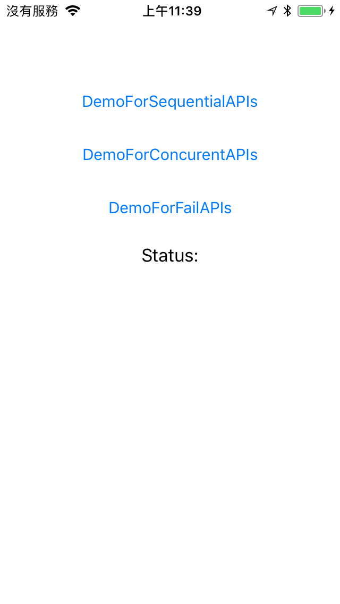
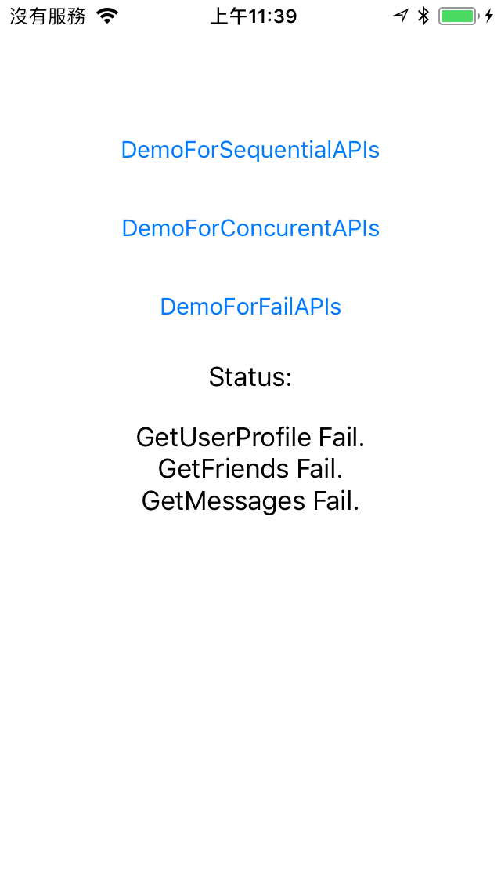
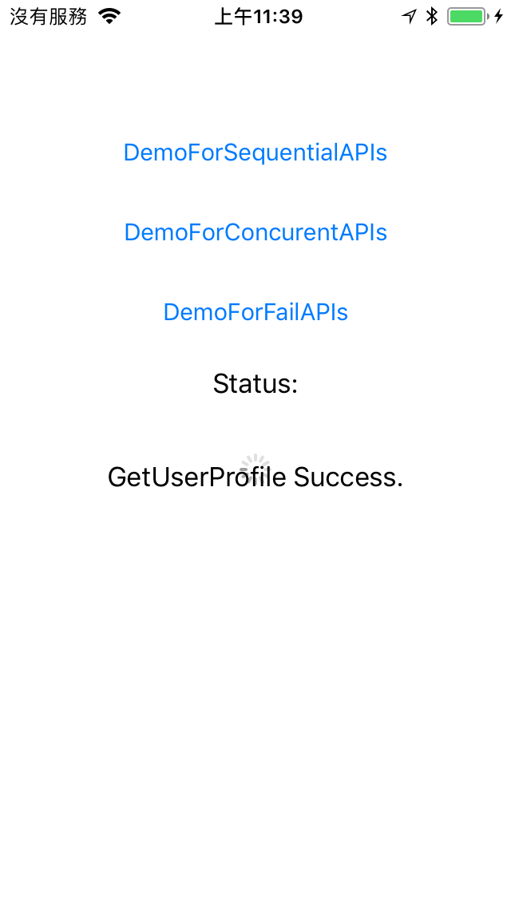
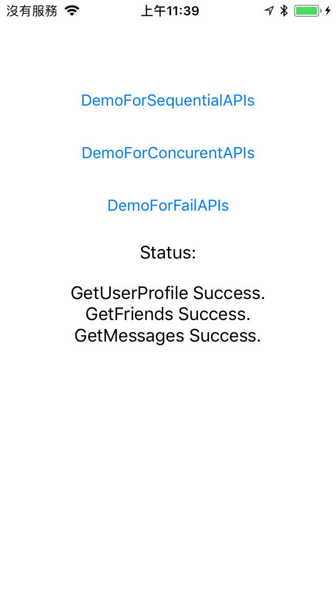

# IRNotificationReceiver 

- IRNotificationReceiver is a powerful notification receiver/manager for iOS, it can set conditions for eazy to manage the notifications. 
- Notification is base on `Observer Pattern`, it is a good feature to send messages between classes and not break you codes structure, but sometimes you have a lot of notifications and want to manage them, like network relative notifications.

## Features
- Customize the notifications.
- Support notifications number control.
- Support notifications ignore mode.
- Support shared notifications.

## Install
### Git
- Git clone this project.
- Copy this project into your own project.
- Add the .xcodeproj into you  project and link it as embed framework.
#### Options
- You can remove the `demo` and `ScreenShots` folder.

### Cocoapods
- Add `pod 'IRNotificationReceiver'`  in the `Podfile`
- `pod install`

## Usage

- Then `demo` project display a situation for network requests. You want to use notifications to deliver the status of requests, they could be success or failure, and called by sequential  or concurent. Use `IRNotificationReceiver` can be eazy to manage these notifications.

### Basic

#### Setup `NotificationReceiver`

```obj-c
#import <IRNotificationReceiver/IRNotificationReceiver.h>

#define GetUserProfileSuccessNotification @"GetUserProfileSuccessNotification"
#define GetFriendsSuccessNotification @"GetFriendsSuccessNotification"
#define GetMessagesSuccessNotification @"GetMessagesSuccessNotification"

NotificationReceiver *notificationReceiver = [[NotificationReceiver alloc] init];
notificationReceiver.repeat = NO;
notificationReceiver.delegate = self;
```

- The default value of `repeat` is `YES`, that means once the conditions are completed, the `NotificationReceiver` will reset and look forward the same conditions again. The situation is use for some the same requests you want to do again, ex: Click a button do 3 requests A, B, C, show the result after the requests are completed, then you can click again.


#### Set `addObserver`, and set `NotificationConditioner`
```obj-c
[notificationReceiver addObserver:self selector:@selector(completionNotifications:) conditioner:[[NotificationConditioner alloc] initWithName:GetUserProfileSuccessNotification minCount:1] ignoreable:YES object:nil];
```

- `ignoreable`
- If set `YES`, while you call `ignoreConditionerWithName` or `ignoreConditioner`, the specific notification would not manage by `checkConditionsWith`. It also triger the ignore delegaet:  `receivedIgnoreConditionerWithName:(NSString*)name` in the `NotificationReceiverDelegate`.

- `minCount`
    - You can set `minCount` to help you promise the number of specific notification are called if verified by  `checkConditionsWith`.

#### Check verified by `checkConditionsWith` 

- Check verified by `checkConditionsWith`, the common way is put the codes in the call back of the requests.
- Important!!! Do `checkConditionsWith` would consume the `minCount` in the `NotificationConditioner`. That means if you set a  `Login NotificationConditioner` with 3 for `minCount`, after you call `checkConditionsWith:@"Login"` three times, the check result would be verified.

```obj-c
[notificationReceiver checkConditionsWith:name verifity:^(BOOL isVerified) {
    if(name) {
        self.statusLabel.text = [self.statusLabel.text stringByAppendingString:[NSString stringWithFormat:@"%@ %@\n", [name stringByReplacingOccurrencesOfString:@"SuccessNotification" withString:@""], @"Success."]];
    }
    
    if(isVerified) {
        [self didUpdate];
    }
}];
```

### Advanced settings

- Use `SharedNotificationConditioner`.
    - The use situation is when you want to do a common request, like `Login`. You just want to do it once, so if logined, then do something, else do `Login`.
    - Use  `SharedNotificationConditioner` for `Login` request in the all of the page that you want to login first. Like Profile page, Friends page, etc....
    
```obj-c
[notificationReceiver addObserver:self selector:@selector(completionNotifications:) conditioner:[[SharedNotificationConditioner sharedInstance] sharedNotificationConditionerWithName:LoginSuccessNotification minCount:1] ignoreable:YES object:nil];
```

## Screenshots
| Main Page | Failure |
|:---:|:---:|
|  |  |
| Sequential Requesting | Sequential Success |
|  |  |
| Concurent Requesting | Concurent Success |
|  |  |
